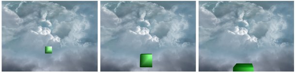

# Skybox

[Skybox](https://learnopengl.com/Advanced-OpenGL/Cubemaps) is a technique used to fake a distant view with 2D textures.
Generally, those textures are stored in a [cube map](https://www.khronos.org/opengl/wiki/Cubemap_Texture).
A cube map consists of 6 textures, and those textures together form a cube.
The distant view (mostly the sky) is rendered to the interior of the cube.
That's why it is called skybox.

To make a skybox realistic, the view must be distant enough so that even the viewer moves, it barely change.
This is the same as our experience in the real world, when we walk toward a sky.

## Note
According to [OpenGL Wiki](https://www.khronos.org/opengl/wiki/Cubemap_Texture),
the face orientation and the corresponding parameter is as following:

```
GL_TEXTURE_CUBE_MAP_POSITIVE_X (0) --> right
GL_TEXTURE_CUBE_MAP_NEGATIVE_X (1) --> left
GL_TEXTURE_CUBE_MAP_POSITIVE_Y (2) --> top
GL_TEXTURE_CUBE_MAP_NEGATIVE_Y (3) --> bottom
GL_TEXTURE_CUBE_MAP_POSITIVE_Z (4) --> back (*)
GL_TEXTURE_CUBE_MAP_NEGATIVE_Z (5) --> front (*)
```

`(*)` The coordinate system used in cube map has a reversed `z` axis, compared to the world space.
That's why the `back` and `front` direction have been reversed.

Logically, images should be written into their corresponding spots.
For example, `right.png` into `GL_TEXTURE_CUBE_MAP_POSITIVE_X` and `top.png` into `GL_TEXTURE_CUBE_MAP_POSITIVE_Y`.
However, in my program, when I do that, I get a disordered skybox.
So I have to reorder those images or the skybox vertices to get a correct result.

Finally, the code has become something like this:

```
"left.png" --> GL_TEXTURE_CUBE_MAP_POSITIVE_X
"right.png" --> GL_TEXTURE_CUBE_MAP_NEGATIVE_X
"bottom.png" --> GL_TEXTURE_CUBE_MAP_POSITIVE_Y
"top.png" --> GL_TEXTURE_CUBE_MAP_NEGATIVE_Y
"front.png" --> GL_TEXTURE_CUBE_MAP_POSITIVE_Z
"back.png" --> GL_TEXTURE_CUBE_MAP_NEGATIVE_Z
```

and the skybox vertices is something like:

```
{rightFace, leftFace, topFace, bottomFace, frontFace, backFace}
```

I cannot figure out why, and since the result is fine,
I've decided to ignore this problem for now.

# Result


